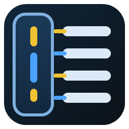

<p align="center">
  
</p>

# Rinemaka

Rinemaka is a VS Code extension for managing line markers in either session scope or workspace scope.  
The sidebar shows marker lists and supports CSV export.

## ✨ Commands

`Rinemaka: Add Session Marker`  
Adds the selected line as a session marker.

`Rinemaka: Add Workspace Marker`  
Adds the selected line as a workspace marker.

`Rinemaka: Toggle Session Marker`  
Adds or removes a session marker on the selected line.

`Rinemaka: Toggle Workspace Marker`  
Adds or removes a workspace marker on the selected line.

`Rinemaka: Remove Marker`  
Removes the marker on the selected line.

`Rinemaka: Clear Session Markers`  
Removes all session markers.

`Rinemaka: Clear Workspace Markers`  
Removes all workspace markers.

`Rinemaka: Export Session Markers`  
Exports session markers to CSV.

`Rinemaka: Export Workspace Markers`  
Exports workspace markers to CSV.

`Rinemaka: Next Marker`  
Moves to the next marker across both session and workspace markers.

`Rinemaka: Previous Marker`  
Moves to the previous marker across both session and workspace markers.

`Rinemaka: Next Session Marker`  
Moves to the next session marker.

`Rinemaka: Previous Session Marker`  
Moves to the previous session marker.

`Rinemaka: Next Workspace Marker`  
Moves to the next workspace marker.

`Rinemaka: Previous Workspace Marker`  
Moves to the previous workspace marker.

## 📌 Features

- Marks full lines like bookmarks.
- Reflects marker positions on the scrollbar.
- Separates temporary session markers from saved workspace markers.
- Supports marker lists and jump actions from the sidebar.
- Supports CSV export for marker lists.

### Session vs Workspace

| Type | Usage |
| --- | --- |
| Session | Temporary markers used only while VS Code is open |
| Workspace | Markers saved in the workspace and available after restart |

## 🗂️ Sidebar

- Adds `Rinemaka` to the sidebar.
- Shows markers in separate `Session Markers` and `Workspace Markers` groups.

## ⚙️ Settings

Marker colors use `rgba(R, G, B, A)` format. Overview ruler colors are reflected on the scrollbar.

`rinemaka.sessionMarkerBackground`  
Background color for session markers.

`rinemaka.sessionMarkerBorder`  
Border color for session markers.

`rinemaka.sessionMarkerOverviewRuler`  
Overview ruler color for session markers.

`rinemaka.workspaceMarkerBackground`  
Background color for workspace markers.

`rinemaka.workspaceMarkerBorder`  
Border color for workspace markers.

`rinemaka.workspaceMarkerOverviewRuler`  
Overview ruler color for workspace markers.

## Defaults

```json
{
  "rinemaka.sessionMarkerBackground": "rgba(255, 215, 0, 0.22)",
  "rinemaka.sessionMarkerBorder": "rgba(255, 215, 0, 0.85)",
  "rinemaka.sessionMarkerOverviewRuler": "rgba(255, 215, 0, 0.9)",
  "rinemaka.workspaceMarkerBackground": "rgba(64, 156, 255, 0.18)",
  "rinemaka.workspaceMarkerBorder": "rgba(64, 156, 255, 0.85)",
  "rinemaka.workspaceMarkerOverviewRuler": "rgba(64, 156, 255, 0.9)"
}
```

## Development

### PowerShell

```powershell
npm.cmd install
npm.cmd run compile
npm.cmd run package
```

### Command Prompt

```cmd
npm install
npm run compile
npm run package
```

## Other

- This extension was created with Codex.

## License

MIT License

